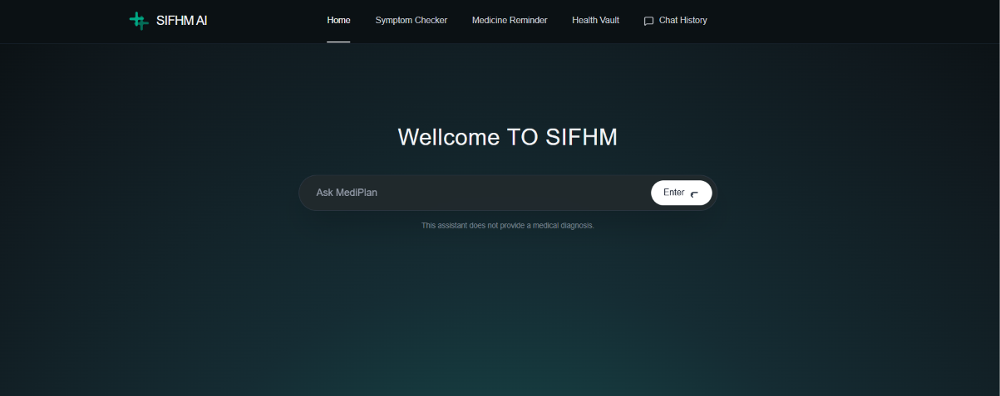
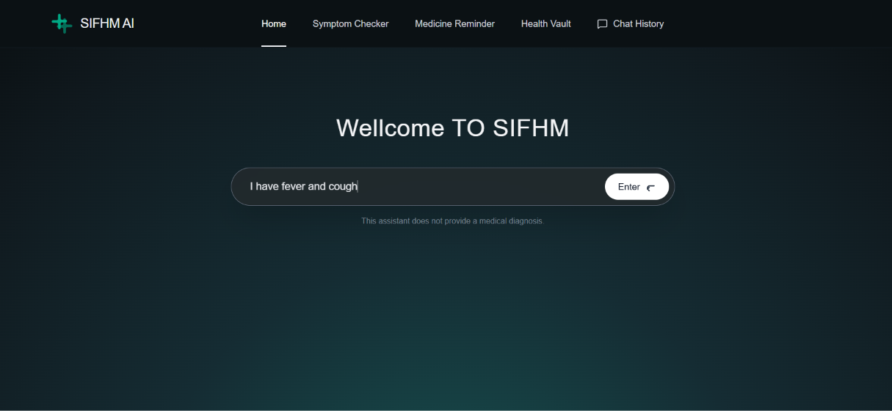
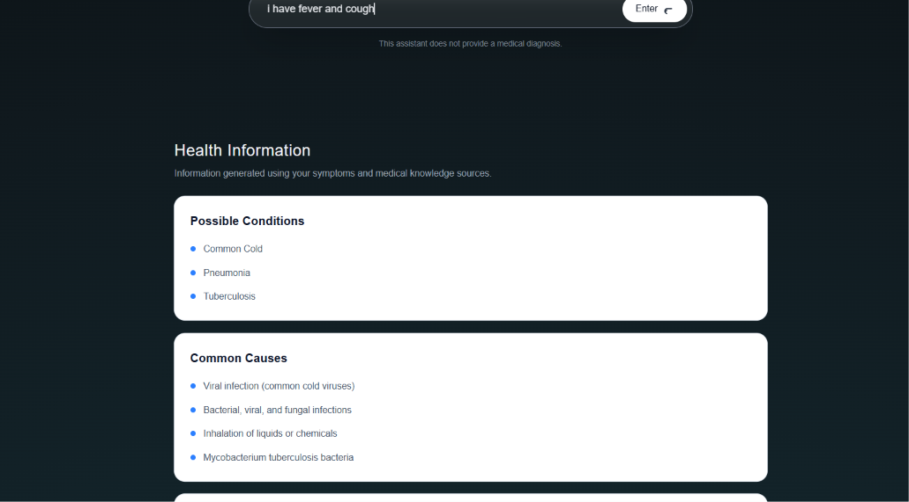
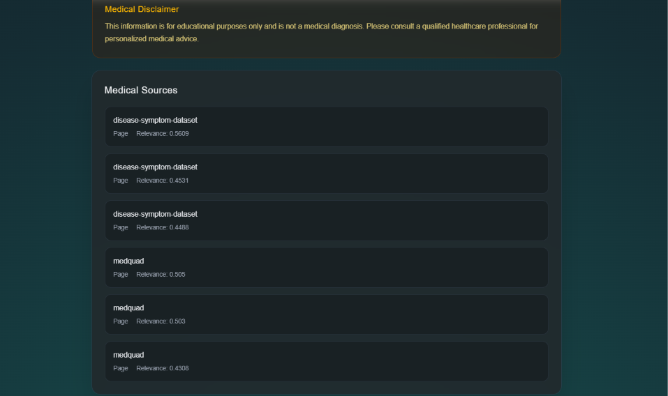
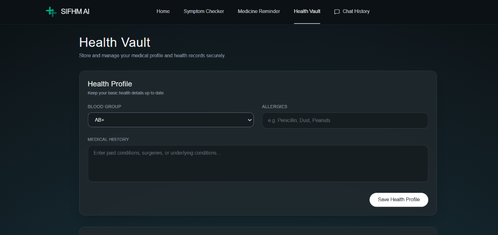
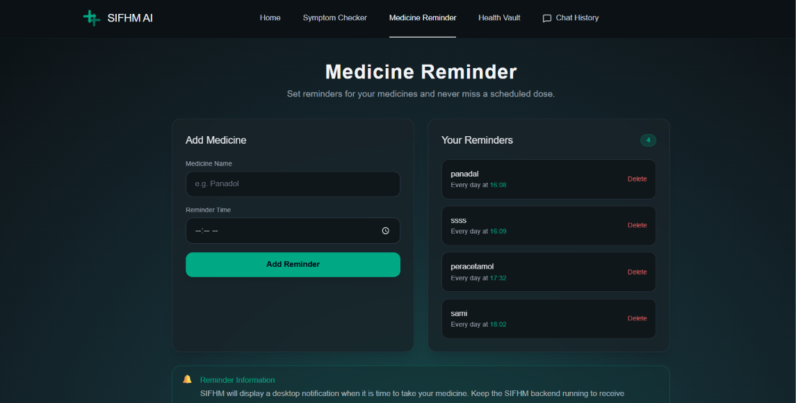
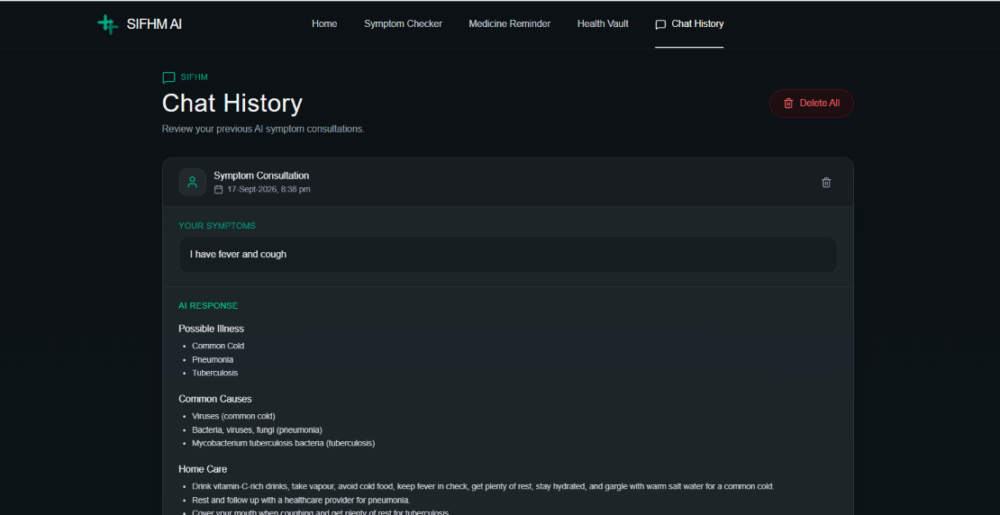
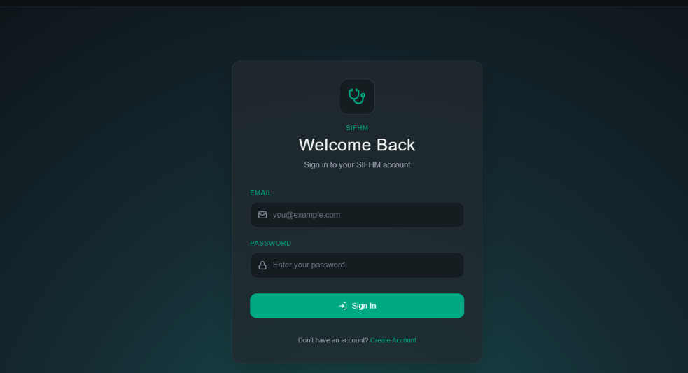
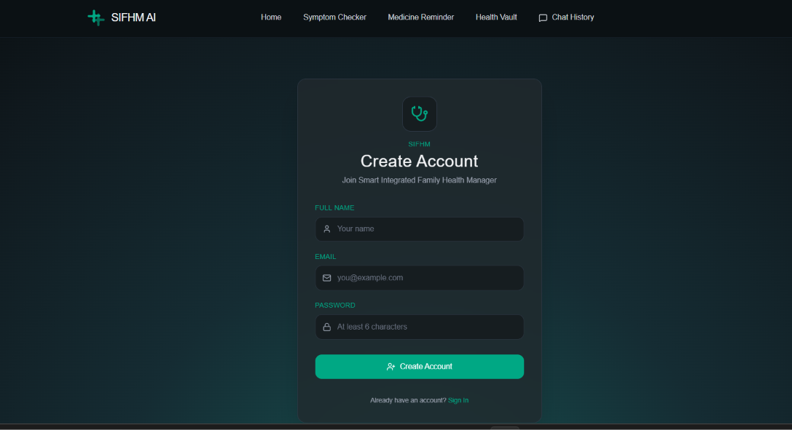

# Smart Integrated Family Health Manager (SIFHM)

SIFHM is an AI-powered family health management system that combines **symptom analysis, Retrieval-Augmented Generation (RAG), personal health records, medicine reminders, and AI chat history** in one application.

The system uses a medical knowledge base with **FAISS vector search, Sentence Transformers, and a Groq-powered LLM** to retrieve relevant information and generate structured responses.

> **Note:** SIFHM is an educational software project and is not a replacement for professional medical diagnosis, treatment, or emergency care.

---

## 🚀 Features

### 🩺 AI Symptom Checker

* Enter symptoms in natural language.
* Uses semantic similarity to retrieve relevant medical information.
* Identifies possible conditions based on the retrieved knowledge.
* Generates a structured AI response.
* Displays supporting medical sources.

### 🧠 Retrieval-Augmented Generation (RAG)

SIFHM does not rely only on the LLM's internal knowledge.

The system first retrieves relevant information from a medical knowledge base and then provides that context to the LLM.

The RAG pipeline includes:

* Sentence Transformers
* FAISS vector indexes
* Disease-symptom dataset
* MedQuAD medical Q&A dataset
* Groq LLM
* Source/reference tracking

### 💊 Medicine Reminder

* Add medicines and schedules.
* Track upcoming reminders.
* Manage medicine information from the application.

### 🗂️ Health Vault

* Store personal health information.
* Maintain health-related records in one place.
* Access saved information through the application.

### 💬 Chat History

* Stores previous AI conversations.
* Allows users to review earlier symptom-checking interactions.

### 🔐 User Authentication

* User signup and login.
* Protected application features.
* Backend authentication and password security.

### ⚠️ Emergency Safety Layer

The system includes a software-level emergency keyword check for certain potentially serious conditions.

When detected, the application can add an emergency-care warning to the generated response.

This is a **software safety layer**, not a guarantee of medical safety or clinical diagnosis.

---

# 🧠 AI / RAG Architecture

The core AI pipeline works as follows:

```text
User Symptoms / Question
          │
          ▼
Sentence Transformer
(all-MiniLM-L6-v2)
          │
          ▼
Query Embedding
          │
          ▼
FAISS Disease-Symptom Index
          │
          ▼
Top Disease Matches
          │
          ▼
MedQuAD Knowledge Retrieval
          │
          ▼
Relevant Medical Context
          │
          ▼
Groq LLM
(Llama Model)
          │
          ▼
Structured JSON Response
          │
          ▼
Emergency Safety Check
          │
          ▼
Response + Sources
```

### Two-Stage Retrieval

SIFHM uses a two-stage retrieval approach instead of performing a single generic vector search.

**Stage 1 — Disease Retrieval**

The symptom query is compared against the disease-symptom FAISS index to identify relevant disease matches.

**Stage 2 — Medical Information Retrieval**

The identified disease information is used to narrow the MedQuAD search and retrieve supporting medical information.

This retrieved context is then passed to the LLM for response generation.

---

# 🛠️ Technology Stack

## Backend

* Python
* FastAPI
* SQLAlchemy
* SQLite
* FAISS
* Sentence Transformers
* Groq API
* Pydantic
* JWT-based authentication

## Frontend

* React
* Vite
* Tailwind CSS
* JavaScript

## AI / Machine Learning

* Sentence Transformers
* `all-MiniLM-L6-v2`
* FAISS vector similarity search
* Retrieval-Augmented Generation (RAG)
* Groq LLM
* Structured JSON generation

## Data

* Disease-Symptom Dataset
* Symptom Description Dataset
* Symptom Precaution Dataset
* MedQuAD Dataset

---

# 📸 Screenshots

## 🏠 Dashboard

The main SIFHM dashboard provides access to the application's health management and AI features.



---

## 🩺 AI Symptom Checker

Users can enter their symptoms and submit them for AI-powered analysis.



---

## 🤖 AI Health Assessment

The system processes the user's symptoms, retrieves relevant medical context, and generates a structured response.

 (screenshots/Ai-result2.png)

---

## 📚 Medical Sources

The application displays supporting sources retrieved through the RAG pipeline.



---

## 🗂️ Health Vault

The Health Vault provides a centralized place to manage personal health information.

 (screenshots/health-vault2.png)

---

## 💊 Medicine Reminder

Users can manage their medicine schedules and reminders.



---

## 💬 Chat History

Previous AI interactions can be accessed through the chat history.



---

## 🔐 Login & Signup

SIFHM includes user authentication for accessing the application.





---

# 📁 Project Structure

```text
SIFHM/
│
├── backend/
│   ├── ai/
│   │   ├── embeddings.py
│   │   ├── prompts.py
│   │   ├── rag.py
│   │   └── vector_store.py
│   │
│   ├── api/
│   │   ├── chat_history.py
│   │   ├── health_vault.py
│   │   ├── medicine_reminder.py
│   │   └── symptom_checker.py
│   │
│   ├── auth/
│   │   ├── models.py
│   │   ├── router.py
│   │   ├── schemas.py
│   │   └── security.py
│   │
│   ├── data/
│   │   ├── disease_faiss.index
│   │   ├── disease_metadata.json
│   │   ├── medquad_faiss.index
│   │   └── medquad_metadata.json
│   │
│   ├── database.py
│   ├── models.py
│   ├── main.py
│   ├── reminder_scheduler.py
│   └── requirements.txt
│
├── frontend/
│   ├── src/
│   │   ├── components/
│   │   ├── App.jsx
│   │   ├── index.css
│   │   └── main.jsx
│   │
│   ├── package.json
│   └── vite.config.js
│
├── Medical_Knowledge_Base/
│   ├── disease-symptom/
│   └── medquad/
│
├── .gitignore
└── README.md
```

---

# ⚙️ Installation

## 1. Clone the Repository

```bash
git clone https://github.com/faisalmohib/smart-integrated-family-health-manager.git
cd smart-integrated-family-health-manager
```

## 2. Create and Activate Virtual Environment

Windows:

```powershell
python -m venv venv
.\venv\Scripts\Activate.ps1
```

## 3. Install Backend Dependencies

```powershell
cd backend
pip install -r requirements.txt
```

## 4. Configure Environment Variables

Create:

```text
backend/.env
```

Add your Groq API configuration:

```env
GROQ_API_KEY=your_groq_api_key
GROQ_MODEL=llama-3.3-70b-versatile
```

> Never commit your `.env` file or API keys to GitHub.

## 5. Install Frontend Dependencies

Open another terminal:

```powershell
cd frontend
npm install
```

---

# ▶️ Running the Application

## Start Backend

From the `backend` directory:

```powershell
uvicorn main:app --reload
```

The FastAPI backend will run locally.

## Start Frontend

In another terminal:

```powershell
cd frontend
npm run dev
```

Open the local Vite URL shown in the terminal.

---

# 🔄 Application Flow

```text
User
 │
 ▼
React Frontend
 │
 ▼
FastAPI Backend
 │
 ├──────────────► Authentication
 │
 ├──────────────► Health Vault
 │
 ├──────────────► Medicine Reminders
 │
 └──────────────► Symptom Checker
                       │
                       ▼
                  RAG Pipeline
                       │
             ┌─────────┴─────────┐
             ▼                   ▼
       FAISS Search        Medical Context
             │                   │
             └─────────┬─────────┘
                       ▼
                    Groq LLM
                       │
                       ▼
                Structured Response
                       │
                       ▼
                 React Frontend
```

---

# 🎥 Demo Video

A short demonstration of SIFHM showing the main application workflow, including authentication, symptom checking, AI-generated results, sources, Health Vault, medicine reminders, and chat history.

**Demo:** [Add demo video link here]

---

# 🔒 Security & Privacy

The project follows basic application security practices, including:

* Environment variables for API credentials.
* `.gitignore` protection for secrets and local databases.
* Password hashing for user authentication.
* Backend API separation.
* Local database storage for development.

For production deployment, additional security measures would be required, including HTTPS, secure secret management, database hardening, rate limiting, monitoring, access controls, and production-grade infrastructure.

---

# ⚠️ Medical Disclaimer

SIFHM is an **educational and software engineering project**.

The information generated by the application should not be treated as professional medical advice, diagnosis, or treatment.

Users should consult a qualified healthcare professional for medical concerns. In an emergency, users should contact appropriate emergency medical services.

---

# 🔮 Future Improvements

* Production PostgreSQL database
* Cloud deployment
* More comprehensive medical knowledge sources
* Improved retrieval evaluation
* Medical response quality evaluation
* Role-based access control
* Better notification infrastructure
* Automated testing
* Observability and logging
* Mobile application
* Improved multilingual support

---

# 👨‍💻 Author

**Faisal Mohib**

AI/ML & Full-Stack Developer

GitHub: [Faisal Mohib](https://github.com/faisalmohib)

---

## ⭐ Project Highlights

SIFHM demonstrates practical implementation of:

* AI application development
* Retrieval-Augmented Generation
* Semantic search
* FAISS vector databases
* Sentence Transformers
* LLM integration
* FastAPI backend development
* React frontend development
* Authentication
* Database integration
* AI response structuring
* Source-aware AI responses
* Software-level safety checks
* Full-stack system integration
